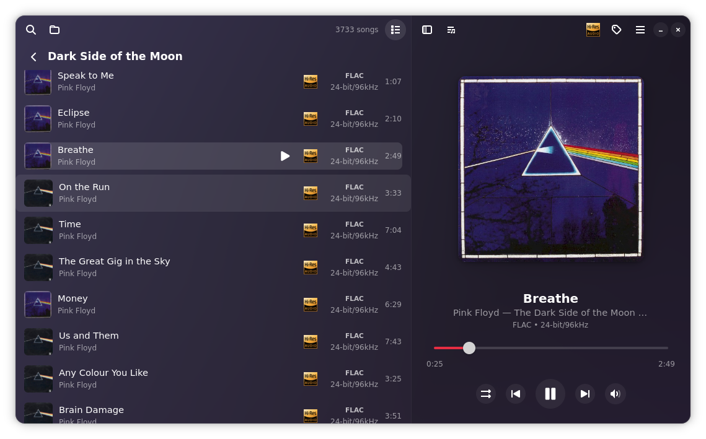
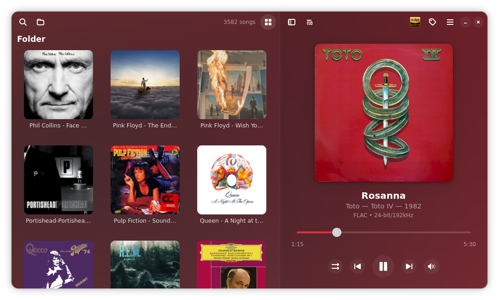
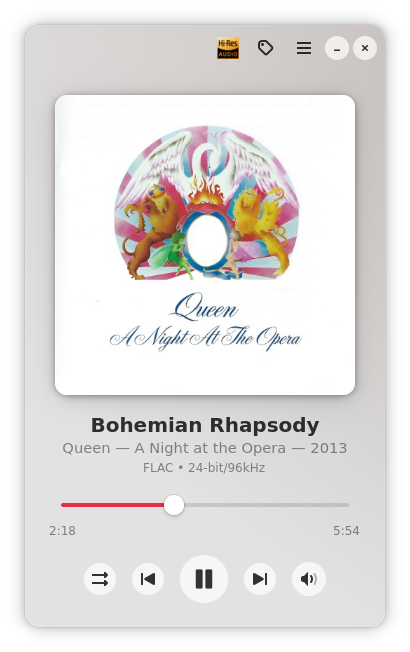
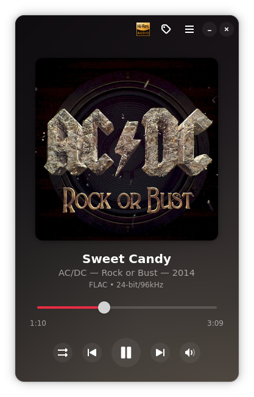

<h1 align="center">FolderPlay</h1>
 

 

**FolderPlay** is a minimalist music player developed in **Rust and GTK4**. Its philosophy is simple: letting you enjoy your local collection by faithfully **respecting your disk's folder structure—it**, doesn't group by artist, album, or genre. It simply respects your order.

Designed with a strong focus on **Lossless Hi-Res audio** playback.

## Features!

- Above all, simple and intuitive.
- Displays your music folders in the exact order you have them on your disk.
- Supports Hi-Res Lossless audio formats: FLAC up to 384 kHz / 32-bit, DSF / DFF (DSD) — DSD64 (352.8 kHz), DSD128 (705.6 kHz), DSD256 (1.4 MHz), DSD512 (2.8 MHz), and all other popular audio formats.
- HiFi audio output selector (PipeWire/ALSA) for passthrough with external DAC, or standard legacy output for compatibility (PulseAudio).
- Smooth folder navigation. Stores song metadata, cover art, and folder information in a local database — no disk reads required to display your collection. Populates the database in seconds and updates changes silently in the background, allowing you to manage large music libraries effortlessly. 
- **Anti Bad Bunny feature: removes any Bad Bunny song from your collection (for the sake of your mental health). Let's promote real music! (Files are not deleted from disk — they are just hidden, in case you have a relapse...)**
- Instant search by song, artist, or album.
- Fluid adaptive UI for different screen sizes.
- Blurs the background color based on the dominant color of the currently playing track's cover art.
- Light and Dark mode.
